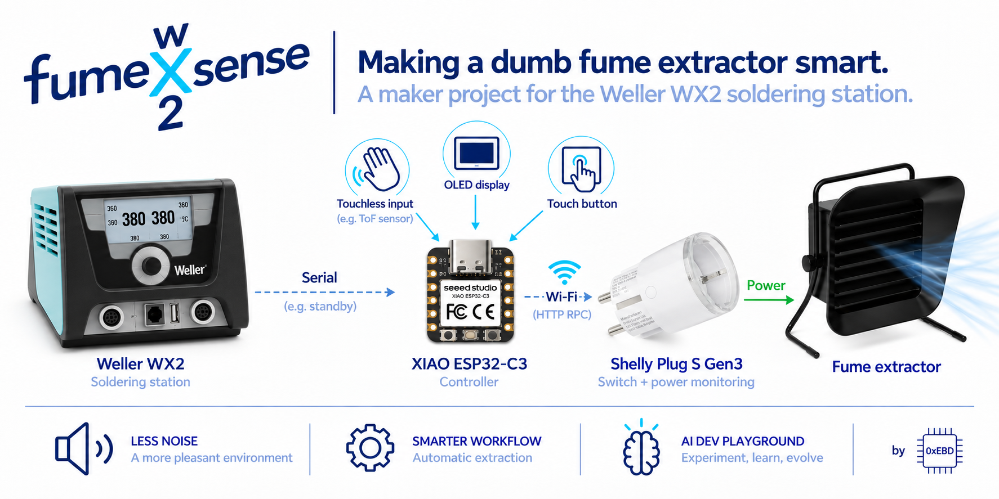
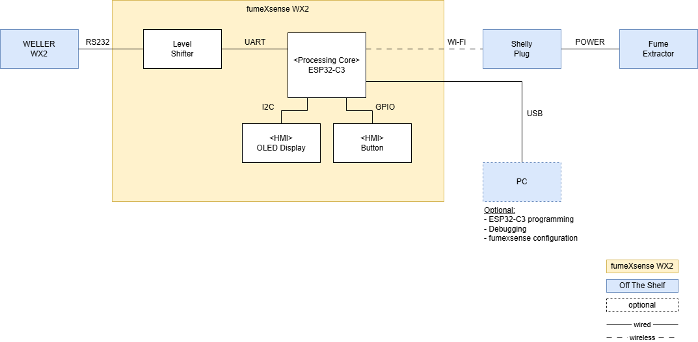

## About the Project

**A soldering station with a serial interface. A perfectly good but dumb and loud fume extractor. An annoyed maker. And an AI-assisted engineering workflow to test and refine. That was enough to start a little maker project.**

The idea behind **fumeXsense** is simple: understand what the Weller WX2 is doing via its serial interface and use that information to control the existing fume extractor automatically.

That is what this project explores — **from first PoC to an embedded reference implementation.**

fumeXsense is also **my playground for testing and refining my AI-assisted embedded software engineering workflow**. That’s why some of the choices here will look the way they do.

Along the way, I am sharing selected milestones and useful results — working PoCs, hardware designs, software, and lessons learned — both here and in a series of LinkedIn posts about the project. This public repository is a curated extract from my private development repository, not a complete development history.

## System Architecture
**fumeXsense sits between the Weller WX2 and the existing fume extractor.** An ESP32-C3 reads the station state via the WX2 serial interface and controls the extractor through an off-the-shelf Shelly smart plug. Local HMI components provide direct interaction with the system.



## Current Status

### 🧪 Proofs of Concept

<table>
  <tr>
    <th>PoC Title</th>
    <th>Status</th>
    <th>Link</th>
  </tr>
  <tr>
    <td>PC-based · “Hello WX2”</td>
    <td>✅ Completed</td>
    <td><a href=pocs/pc_tool/>Folder</a></td>
  </tr>
  <tr>
    <td>ESP32-C3-based “Hello WX2”</td>
    <td>🚧 In progress</td>
    <td>-</td>
  </tr>
    <tr>
    <td>HW Journey - From A to B1</td>
    <td>🕒 Planned</td>
    <td>-</td>
  </tr>
</table>


### 📐 Reference Implementation

<table>
  <tr>
    <th>Artifact</th>
    <th>Status</th>
    <th>Link</th>
  </tr>
  <tr>
    <td>fumeXsense wx2</td>
    <td>🔲 Open</td>
    <td>-</td>
  </tr>
</table>

## Engineering Journey
The project follows a development philosophy that will probably feel familiar to anyone working in embedded systems. **The new part: AI-accelerated.**

**Explore quickly. Prove concepts on real hardware. Engineer deliberately.**

**Ideas** first become **Proofs of Concept (PoCs)**. Their purpose is to answer technical questions, explore alternatives, and demonstrate that a concept works. A PoC is deliberately allowed to be experimental — its primary goal is learning and proof, not maintainability. AI accelerates this exploration through a cross  of **“vibe coding” and "specdriven coding"**

Once a concept has been demonstrated, it can move into the **Reference Implementation**. At this point, the focus changes from *making it work* to understanding, reviewing, structuring, integrating, and validating the solution as a maintainable baseline. AI accelerates this phase too — but with a different mindset: **“AI assisted software engineering.”**


## Repository Structure
The repository structure follows the same development philosophy. Experimental artifacts remain separated from the evolving reference implementation.

```text
pocs/
├── pc_tool/
└── esp32/

reference_design/
├── sw/
├── hw/
└── mechanic/
```

`pocs/` contains self-contained experimental artifacts used to explore and demonstrate concepts.

`reference_design/` contains the evolving maintained implementation built from proven concepts.

Each area contains the software, hardware, mechanical, and supporting documentation relevant to that development stage.

## Documentation
Documentation is kept close to the corresponding artifacts rather than collected into a single project manual.

PoCs document their **goal, implementation, demonstrated result, and known limitations**.

The Reference Implementation will document the interfaces, architecture, hardware, software, and design decisions of the maintained baseline.

## Roadmap
What started as a PC-based **“Hello World” quickly turned into a Hello World on steroids.** With AI-assisted rapid prototyping, the PoC grew beyond its original scope and demonstrated the core concept end to end.

The current focus is an **ESP32-C3-based PoC**, moving the concept onto the embedded target and extending the system step by step.

From there, proven concepts will be reviewed, refactored, integrated, and validated into the **Reference Implementation**.


## LinkedIn Posts

I am documenting selected milestones and lessons from the project in a series of LinkedIn posts. The posts tell the story behind the development, while this repository contains the corresponding engineering artifacts.

<table>
  <thead>
    <tr>
      <th>Post</th>
      <th>Topic</th>
      <th>Status</th>
      <th>Link</th>
    </tr>
  </thead>
  <tbody>
    <tr>
      <td>01</td>
      <td>Introducing fumeXsense WX2</td>
      <td>✅ Posted</td>
      <td><a href=“https://www.linkedin.com/posts/andreas-jarosch_embeddedsystems-esp32-maker-activity-7502718935780327424-sQWo”>LinkedIn</a></td>
    </tr>
    <tr>
      <td>02</td>
      <td>PoC: PC-based “Hello WX2”</td>
      <td>🚧 In progress</td>
      <td>coming soon</td>
    </tr>
    <tr>
      <td>03</td>
      <td>PoC: ESP32-C3-based “Hello World”</td>
      <td>🕒 Planned</td>
      <td>-</td>
    </tr>
  </tbody>
</table>

## Licenses

Unless otherwise noted:

- **Software** is licensed under the [MIT License](LICENSES/MIT.txt).
- **Hardware designs** are licensed under the [CERN Open Hardware Licence Version 2 – Permissive](LICENSES/CERN-OHL-P-2.0.txt).

See the [LICENSES](licenses/) directory for the full license texts.

## Disclaimer
fumeXsense wx2 is an experimental, open-source maker project, not a certified or commercially supported product. It is not affiliated with or endorsed by Weller or Shelly.

The software and hardware designs are provided **”AS IS”**, without warranty. Users are responsible for evaluating their own implementations and ensuring safe installation and operation, particularly when working with mains-powered equipment and fume extraction.

Do not rely on this project as the sole means of protection against soldering fumes. Consult the applicable licenses for the full warranty disclaimers and limitations of liability.

—

*Built by [0xEBD](https://github.com/0xEBD) — made with embedded passion.*
