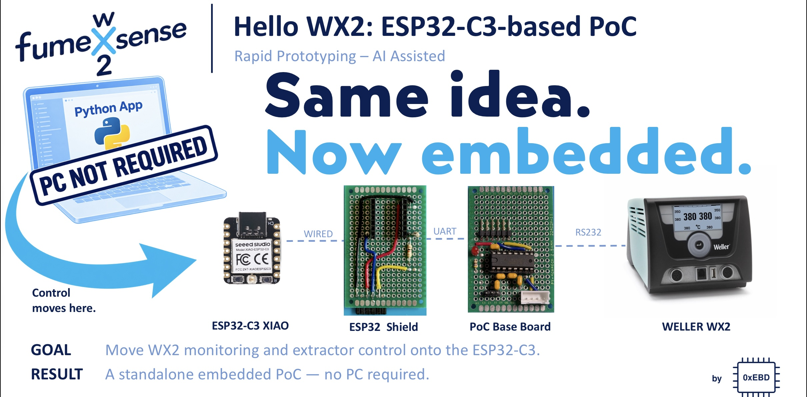
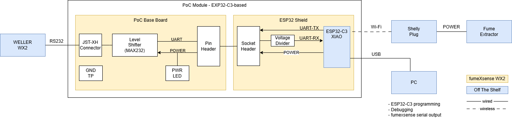

# PoC - ESP32-C3-based “Hello WX2”

**Type:** 🧪 Proof of Concept

**Status:** ✅ Completed

**Summary:** The PC is gone. This PoC moves the core fumeXsense control loop demonstrated in the previous PC-based PoC onto an ESP32-C3.

With the WX2 interface already understood, the transition was deliberately small: port the software with AI assistance, add a simple ESP32 shield to the existing base board, and preserve the result as a minimal embedded “Hello World” before the skeleton evolves.

## Goal

Move the demonstrated fumeXsense concept onto an ESP32-C3:

- replace the PC with an embedded controller
- reuse the existing PoC base board
- retain the WX2 → extractor control loop
- establish a minimal working embedded skeleton

In other words: **same idea, now embedded.**

## Documentation

The PoC documentation consists of three documents:

- 📄 Overview (this page): goal, strategy, system overview and results
- 🔧 [Hardware](hw/README.md): ESP32 shield, base board and integration
- 💻 [Software](sw/README.md): ESP32-C3 software, build and run

## PoC Strategy

**Port first. Evolve later.**

The PC-based PoC had already answered the exploratory questions and demonstrated the complete control loop. Rather than redesigning it, this PoC ports the proven behavior to the ESP32-C3 with minimum effort: reuse the base board, add an ESP32 shield, and port the software with AI assistance.

## PoC System Overview

### Architecture

The ESP32-C3 replaces the PC as the central controller. It communicates directly with the WX2 through the existing RS-232 base board and controls the Shelly smart plug via Wi-Fi.

Hardware details: see [Hardware](hw/README.md). Software details: see [Software](sw/README.md).

### Features

- WX2 communication via UART / RS-232
- WX2 channel state monitoring
- Shelly smart plug control via Wi-Fi
- Automatic fume extractor control
- Configurable run-on delay
- Validation of desired vs. actual Shelly state
- Extractor health monitoring based on power consumption

## Demonstrated Result

- ✅ No PC required - Port to ESP32-C3 successful
- ✅ Direct WX2 communication
- ✅ Automatic extractor control
- ✅ Shelly integration via Wi-Fi
- ✅ Standalone embedded operation

## Known Limitations

This is an intentionally simple, functionally tested PoC — not a hardened or maintainable software baseline.

- No systematic tests
- Limited error handling and recovery
- No Shelly authentication support
- Tested with a single hardware setup only

## Lessons Learned

- A well-understood PC prototype can make the transition to embedded hardware surprisingly small.
- AI assistance made the software port almost immediate, while reusing the base board kept the hardware transition equally small.
- A minimal working “Hello World” snapshot is worth preserving before additional features and architecture hide the underlying skeleton.

Moving to an embedded target does not change the maturity level: **this is still a PoC.**

## Next Step

Build on this minimal embedded skeleton, adding functionality incrementally and evolving the software architecture as the system grows.

## ⚠️ Safety ⚠️

This setup taps into the interface of a mains-powered soldering station and switches mains power via a smart plug. Build and use it at your own risk. Never leave the setup unattended during operation.

Do not rely on this project as the sole means of protection against soldering fumes.

## All fumeXsense PoCs

[→ Project Evolution & Current Status](../../../../README.md#project-evolution-and-current-status)

## LinkedIn Post

I am documenting selected milestones and lessons from the project in a series of LinkedIn posts. The posts tell the story behind the development, while this repository contains the corresponding engineering artifacts.

📣 **LinkedIn:**  
- **This PoC** [PoC: PC-based “Hello WX2” — View post ](LINK)
- **Overview ALL Posts** [fumeXsense LinkedIn Series](../../../../README.md#linkedin-posts)

## Disclaimer

fumeXsense WX2 is an experimental, open-source maker project, not a certified or commercially supported product.

It is not affiliated with or endorsed by Weller or Shelly.

The software and hardware designs are provided “AS IS”, without warranty. Users are responsible for evaluating their own implementations and ensuring safe installation and operation, particularly when working with mains-powered equipment and fume extraction.

Weller® and Shelly® are registered trademarks of their respective owners.

## License

See the [fumeXsense main README](../../README.md) and [LICENSE](../../LICENSE).