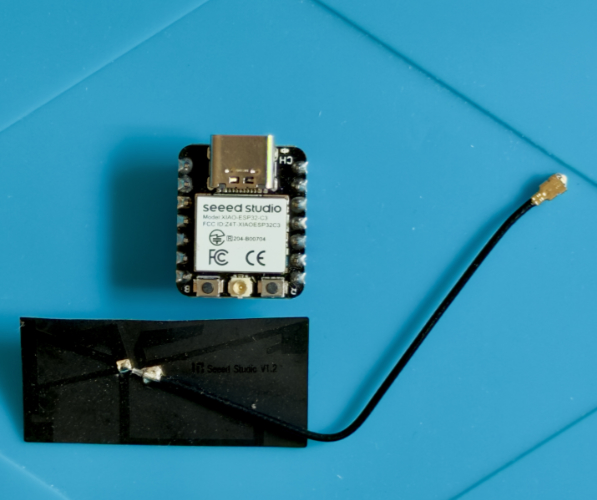
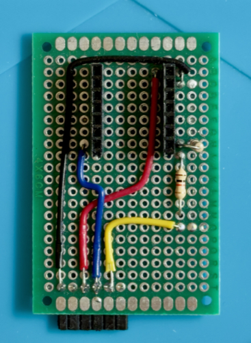
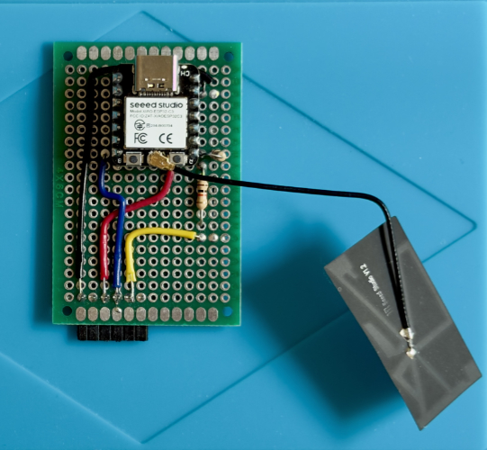
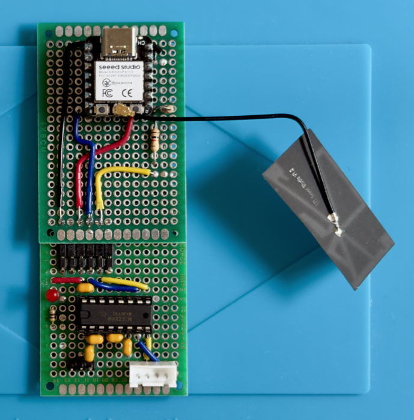
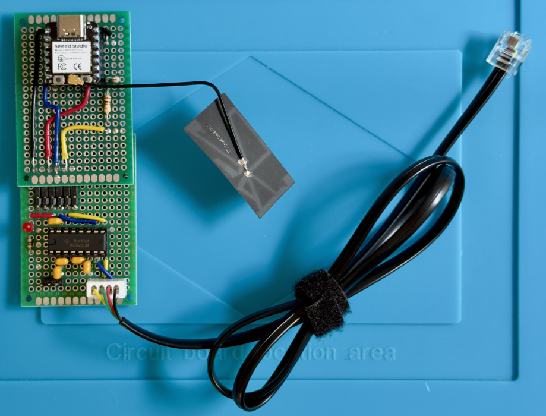

# PoC Hardware - ESP32-C3-based “Hello WX2”

← Back to the [PoC overview](../README.md) · See also: [Software](../sw/README.md)

⚠️ Before building or connecting anything, read the Safety and Disclaimer sections of the [PoC overview](../README.md).

ℹ️ No KiCad schematic is provided for this PoC. The pinouts below document its interfaces. A proper schematic will follow with the B2 sample, a more mature hardware revision of the fumeXsense PCB.

## What Changed Since the PC-based PoC

The hardware is deliberately almost identical to the [PC-based “Hello WX2”](../../../../pc_tool/hw/README.md). Only the “Processing Core Shield” was swapped:

<table>
  <thead>
    <tr><th>PC-based PoC</th><th>ESP32-C3-based PoC</th></tr>
  </thead>
  <tbody>
    <tr><td>PC (Windows 11) + Python app</td><td>Seeed XIAO ESP32-C3 + firmware</td></tr>
    <tr><td>CH340 breakout as shield</td><td>ESP32 shield</td></tr>
    <tr><td>PoC base board</td><td>PoC base board — reused unchanged</td></tr>
    <tr><td>Modified 6P4C cable</td><td>Modified 6P4C cable — reused unchanged</td></tr>
  </tbody>
</table>

This is exactly what the modular shield header was made for: same base board, new processing core.

## Overview / BOM

<table>
  <thead>
    <tr>
      <th>Component</th>
      <th>Details</th>
    </tr>
  </thead>
  <tbody>
    <tr>
      <td>Weller WX2</td>
      <td>
        - Soldering station 
        - Serial interface via 6P6C jack (RS-232 levels)
      </td>
    </tr>
    <tr>
      <td>Seeed XIAO ESP32-C3</td>
      <td>
        - Processing core, replaces the PC 
        - Wi-Fi for Shelly control 
        - External Wi-Fi antenna (U.FL, included with the XIAO) 
        - Powered via USB-C (USB power supply or PC USB port) 
        - 3.3 V logic levels 
        - Provides 5 V supply for the circuit boards
      </td>
    </tr>
    <tr>
      <td>ESP32 Shield</td>
      <td>
        - Hand-soldered adapter between XIAO and base board pin header 
        - Supplies 5 V to the base board 
        - Adapts the 5 V UART signal from the MAX232 to 3.3 V via a simple resistor voltage divider
      </td>
    </tr>
    <tr>
      <td>PoC Base Board</td>
      <td>
        - Reused unchanged from the PC-based PoC (see <a href=../../../../pc_tool/hw/README.md>                                                                                                                                                  PoC PC-based HW</a>) 
        - MAX232 RS-232 level shifting (5 V)
      </td>
    </tr>
    <tr>
      <td>Modified 6P4C Cable (RJ11 type)</td>
      <td>
        - Reused unchanged from the PC-based PoC (see <a href=../../../../pc_tool/hw/README.md>                                                                                                                                                  PoC PC-based HW</a>)  
        - 💡 Recommended for rebuilds: a 6P6C cable (RJ12 type)
      </td>
    </tr>
    <tr>
      <td>Shelly Plug S Gen3</td>
      <td>
        - Smart plug for switching the fume extractor 
        - Controlled via local RPC HTTP API over Wi-Fi
      </td>
    </tr>
    <tr>
      <td>Fume Extractor</td>
      <td>Existing 230 V mains-powered device</td>
    </tr>
  </tbody>
</table>

## Seeed XIAO ESP32-C3

The Seeed Studio XIAO ESP32-C3 is a thumbnail-sized development board with Wi-Fi, USB-C and a useful set of basic peripherals for maker projects — of course in limited quantity due to its small size. It replaces the PC as the processing core.

The XIAO ESP32-C3 is one of my favorite boards for quickly building small Wi-Fi-enabled maker projects. For me, it offers amazing bang for the buck: inexpensive, compact, easy to work with and backed by the familiar ESP32/Arduino ecosystem.

And as a small bonus: the gummy-bear-style packaging still makes me laugh every time a new batch arrives. 😄

📡 **Antenna:** The XIAO ESP32-C3 uses an external Wi-Fi/Bluetooth antenna. The antenna supplied with the board must be connected to the U.FL connector for reliable wireless operation.

🔗 **Manufacturer:** [Seeed Studio — XIAO ESP32-C3](https://wiki.seeedstudio.com/XIAO_ESP32C3_Getting_Started)

## ESP32 Shield

The shield connects the XIAO ESP32-C3 to the “Processing Core Shield” header of the base board, taking the place of the CH340 breakout used in the PC-based PoC.

### 5 V Supply, 3.3 V Logic

There are two different voltage domains to consider:

- **Logic Signals**: The XIAO ESP32-C3 uses **3.3 V logic** - meaning that                                                                                                                                                    its GPIO signals operate at 3.3 V and the inputs are **not 5 V tolerant**.
- **Power Source**  At the same time, when powered through USB-C, the XIAO provides the USB **5 V supply on its 5V pin**. This 5 V rail can be used to power external circuitry even though the ESP32-C3 itself communicates using 3.3 V logic.

The original base board uses a **5 V MAX232**, so the shield handles the interface between these two logic levels:

- **Power:** The XIAO’s 5V pin supplies the base board and its MAX232 with 5 V.
- **RX (base board → ESP32-C3):** The MAX232 produces a 5 V logic signal, which must not be connected directly to an ESP32-C3 input. A resistor voltage divider on the shield reduces this signal to a safe 3.3 V level.
- **TX (ESP32-C3 → base board):** The ESP32-C3 sends a 3.3 V logic signal to the MAX232. This is high enough to be recognized as logic HIGH by the MAX232, so no level adaptation is required in this direction.

In short:

`USB-C → XIAO 5V → 5 V base board / MAX232`

`MAX232 5 V TX → voltage divider → ESP32-C3 3.3 V RX`

`ESP32-C3 3.3 V TX → MAX232 RX`

💡 **B2 board revision:** The B2 sample uses a MAX3232 powered from 3.3 V instead of the 5 V MAX232. Its logic interface is therefore directly compatible with the ESP32-C3, and the RX voltage divider on the shield is no longer required.

### Pinout

ESP32 shield to base board header (base board pins numbered left to right):

<table>
  <thead>
    <tr><th>Header Pin</th><th>Signal</th><th>XIAO ESP32-C3 Pin</th><th>Note</th></tr>
  </thead>
  <tbody>
    <tr><td>1</td><td>GND</td><td>GND</td><td>Ground</td></tr>
    <tr><td>2</td><td>n.c.</td><td>-</td><td>Not used</td></tr>
    <tr><td>3</td><td>VCC</td><td>5V</td><td>5 V supply for the base board</td></tr>
    <tr><td>4</td><td>TX</td><td>D7 / GPIO20 (RX)</td><td>UART: base board TX → ESP32-C3 RX, via voltage divider</td></tr>
    <tr><td>5</td><td>RX</td><td>D6 / GPIO21 (TX)</td><td>UART: ESP32-C3 TX → base board RX, direct</td></tr>
    <tr><td>6</td><td>n.c.</td><td>-</td><td>Not used</td></tr>
  </tbody>
</table>

With the XIAO and its Wi-Fi antenna mounted, the shield forms the complete processing core for this PoC.

## PoC Module ESP32-based — Integrating Base Board & ESP32 Shield

The ESP32 shield plugs directly into the “Processing Core Shield” header of the existing PoC base board. Together, the two boards form the complete ESP32-based PoC module.

The modular approach allows the same base board to be reused with different processing cores — putting the “Processing Core Shield” concept into practice. And for rapid prototyping: stay fast, reuse what already works — no need to build it twice. 😉

## Complete Set-Up — PoC Module and Cable

The complete ESP32-based PoC: base board, ESP32 shield and modified WX2 cable. What previously required a PC now runs entirely on the ESP32-C3 — no PC required.

← Back to the [PoC overview](../README.md) · See also: [Software](../sw/README.md)