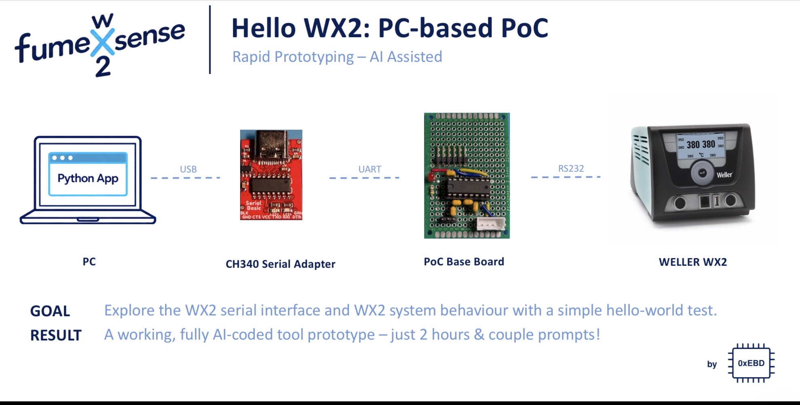
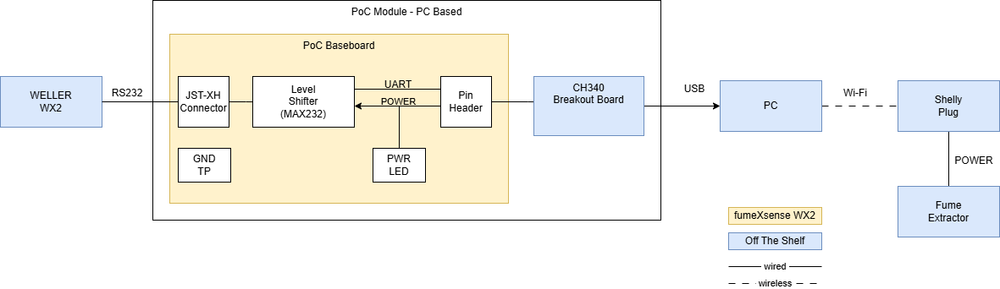
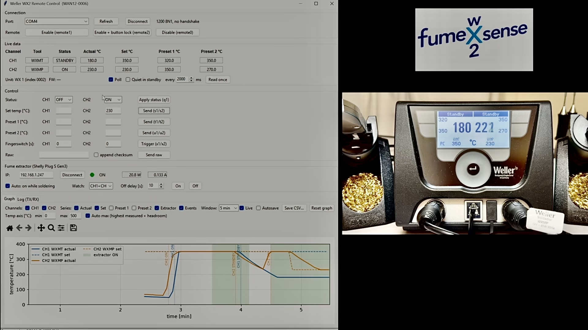

# PoC — PC-based “Hello WX2”

**Type:** 🧪 Proof of Concept

**Status:** ✅ Completed

**Summary:** What started as a simple PC-based “Hello WX2” experiment grew into an end-to-end demonstration of the fumeXsense concept. A Python application communicates with the Weller WX2, visualizes live temperature data, and automatically controls an existing fume extractor through a Shelly smart plug.

The software was built in about 2 hours using AI-assisted development, with engineering focus on interface analysis, verification against real hardware, and design reviews.

The rapid PoC deliberately accepted shortcuts and imperfect assumptions. Where these surfaced, they are documented together with their resolution and lessons learned.

## Goal
The goal is simple: establish communication with the Weller WX2 serial interface from a PC, understand how to receive and interpret its data, verify the interface pinout, and gain a first understanding of the WX2’s dynamic system behavior.

In other words: a simple **”Hello WX2”**.

## Documentation

The PoC documentation consists of three documents:

- 📄 Overview (this page): goal, strategy, system overview and results
- 🔧 [Hardware](hw/README.md): BOM, base board, pinouts, cable, integration
- 💻 [Software](sw/README.md): Python application, build and run

## PoC Strategy

**Start with the shortest path to a working “Frankenstein” system.**

A PC and Python provide a fast environment for exploring an unfamiliar interface, inspecting data, testing assumptions, and iterating directly against real hardware.

On the hardware side, a simple hand-soldered through-hole PCB was built as the base board, keeping the setup quick to assemble and easy to modify.

AI-assisted rapid prototyping was deliberately used to accelerate this exploration. AI assistance was used not only for coding but also for design and code reviews, to catch issues early without slowing down the iteration.

## PoC System Overview

### Architecture

The PC acts as the central controller. It receives data from the WX2 through the Poc Module’s serial to USB interface, processes the station state in Python, and switches the fume extractor through a Shelly smart plug via Wi-Fi.

Hardware details: see [Hardware](hw/README.md). Software details: see [Software](sw/README.md).

### Features

#### Fume Extractor Control

- **ON:** as soon as any watched channel (CH1, CH2 or both) reports status ON.
- **OFF:** when all watched channels are OFF, STANDBY or AUTOOFF, after a configurable off delay (default 10 s, range 0 to 600 s).
- **Manual On/Off** is available; the automatic rule may override it on the next status poll.
- **Changes made outside the tool** (plug button, Shelly app) are detected and adopted.
- **Health check:** if the relay is ON but the extractor draws less than 5 W for 3 consecutive polls, a red warning banner is shown. It is informational only; nothing is switched or blocked.

#### WX2 Monitoring and Control

- **Graphical visualization** of station temperatures and status events per channel
- **Manual triggering** of all commands available through the serial interface
- **Adjustment of parameters** during runtime

## Demonstrated Result

*Screenshot from the demo video: the set temperature of 230 °C sent to CH2 via the GUI appears on the station display. Status values may briefly differ from the display due to the 2 s polling interval.*

The PoC successfully demonstrated the core concept end to end:

- ✅ Communication with the Weller WX2
- ✅ Interpretation of WX2 data on a PC
- ✅ Live temperature visualization
- ✅ Shelly smart plug integration via Wi-Fi
- ✅ Automatic fume extractor control based on WX2 state

## Known Limitations
The implementation was developed for rapid exploration and functionally tested against the real hardware. Design and code were reviewed with AI assistance (Claude, ChatGPT), but not through a formal review process. It is not a hardened or maintainable software baseline. In particular:

- No automatic serial reconnect after a disconnect
- No Shelly authentication support (unauthenticated HTTP in the local network)
- Tested on Windows 11 with a single setup only
- No systematic tests

## Lessons Learned

- The WX2 serial interface provides the information required for the fumeXsense concept.
- A PC/Python setup is an effective environment for quickly exploring the interface and system behavior.
- The complete control loop can be demonstrated before committing the functionality to embedded hardware.
- AI-assisted rapid prototyping can move a small interface experiment surprisingly quickly toward a functional system-level PoC.
- A working PoC provides valuable evidence and reusable concepts, but does not automatically make its implementation suitable for the Reference Implementation.

## Next Step

Move the demonstrated concept onto the **ESP32-C3**.

## ⚠️ Safety ⚠️

This setup taps into the interface of a mains-powered soldering station and switches mains power via a smart plug. Build and use it at your own risk. Never leave the setup unattended during operation.

Do not rely on this project as the sole means of protection against soldering fumes.

## LinkedIn Posts

I am documenting selected milestones and lessons from the project in a series of LinkedIn posts. The posts tell the story behind the development, while this repository contains the corresponding engineering artifacts.

Below you’ll find the kick-off post for the series and the post covering this PoC.

<table>
  <thead>
    <tr>
      <th>Post</th>
      <th>Topic</th>
      <th>Status</th>
      <th>Link</th>
    </tr>
  </thead>
  <tbody>
    <tr>
      <td>01</td>
      <td>Introducing fumeXsense WX2</td>
      <td>✅ Posted</td>
      <td><a href=“https://www.linkedin.com/posts/andreas-jarosch_embeddedsystems-esp32-maker-activity-7502718935780327424-sQWo”>LinkedIn</a></td>
    </tr>
    <tr>
      <td>02</td>
      <td>PoC: PC-based “Hello WX2”</td>
      <td>🚧 In progress</td>
      <td>coming soon</td>
    </tr>
  </tbody>
</table>

## Disclaimer

fumeXsense WX2 is an experimental, open-source maker project, not a certified or commercially supported product.

It is not affiliated with or endorsed by Weller or Shelly.

The software and hardware designs are provided “AS IS”, without warranty. Users are responsible for evaluating their own implementations and ensuring safe installation and operation, particularly when working with mains-powered equipment and fume extraction.

Weller® and Shelly® are registered trademarks of their respective owners.

## License

See the [fumeXsense main README](../../README.md) and [LICENSE](../../LICENSE).
