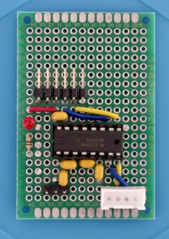
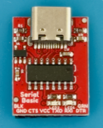
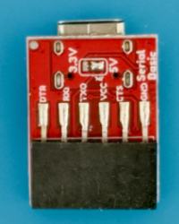
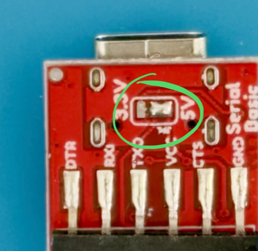
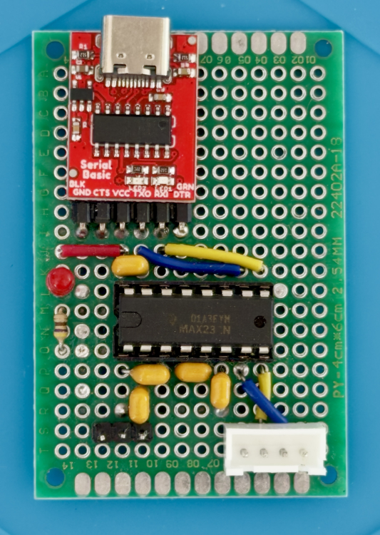
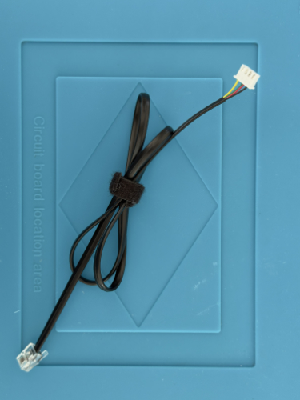
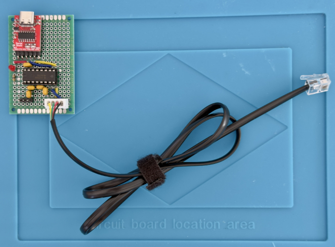

# PoC Hardware — PC-based “Hello WX2”

← Back to the [PoC overview](../README.md) · See also: [Software](../sw/README.md)

⚠️ Before building or connecting anything, read the Safety and Disclaimer sections of the [PoC overview](../README.md).

ℹ️ No KiCad schematic is provided for this first PoC board. The pinouts below document its interfaces. A proper schematic will follow with the B2 sample, a more mature hardware revision of the fumeXsense PCB.

## Overview / BOM

<table>
  <thead>
    <tr>
      <th>Component</th>
      <th>Details</th>
    </tr>
  </thead>
  <tbody>
    <tr>
      <td>Weller WX2</td>
      <td>
        - Soldering station 
        - Serial interface via 6P6C jack (RS-232 levels)
      </td>
    </tr>
    <tr>
      <td>PC</td>
      <td>
        - Processing core substitute for rapid prototyping in a PC environment 
        - Windows 11
      </td>
    </tr>
    <tr>
      <td>PoC Base Board</td>
      <td>
        - Hand-soldered through-hole PCB 
        - MAX232 RS-232 level shifting (5 V) 
        - Pin header: interface for connecting PoC shields (“Processing Core Shield”) 
        - JST-XH: interface for the modified cable to the WX2 
        - LED power indication
      </td>
    </tr>
    <tr>
      <td>CH340 Breakout Board</td>
      <td>
        - USB-to-UART adapter, configured for 5 V via solder bridge 
        - PoC shield for connecting the PC
      </td>
    </tr>
    <tr>
      <td>Modified 6P4C Cable (RJ11 type)</td>
      <td>
        - WX2 side: 6P4C plug (fits the 6P6C jack of the WX2) 
        - Base board side: plug replaced with a crimped JST-XH connector 
        - 💡 Recommended for rebuilds: order a 6P6C cable (RJ12 type), which matches the WX2 jack and connects all 6 contacts
      </td>
    </tr>
    <tr>
      <td>Shelly Plug S Gen3</td>
      <td>
        - Smart plug for switching the fume extractor 
        - Controlled via local RPC HTTP API over Wi-Fi
      </td>
    </tr>
    <tr>
      <td>Fume Extractor</td>
      <td>Existing 230 V mains-powered device</td>
    </tr>
  </tbody>
</table>

## PoC Base Board

**Purpose:** The WX2 serial interface uses RS-232 signal levels, so the base board converts them to UART levels. Its modular “Processing Core Shield” header allows different processing cores to use the same hardware — the PC via CH340 in this PoC, and an ESP32-C3 in the next “Hello WX2” PoC.

**Note on the level shifter:** The MAX232 is not a particularly good choice for this board. It requires a 5 V supply and works with 5 V UART signal levels, while the later processing core (ESP32-C3) uses 3.3 V signal levels. The standard CH340 breakout, supplying the MAX232, is most often configured for 3.3 V as well; for this PoC it was switched to 5 V via a solder bridge (see [CH340 Breakout Board](#ch340-breakout-board)). The MAX3232 would be the proper 3.3 V-compatible choice. But the MAX232 was sitting in the parts box, ready to use — and for a quick “Hello World”, that won.😉

💡 **Hint:** In the B2 hardware sample of the fumeXsense board, the MAX232 was replaced with a MAX3232, making the board 3.3 V-compatible and ready for the ESP32-C3. Separate PoC to come!

⚠️ Do not connect this board directly to an ESP32-C3: the MAX232 receiver output drives about 5 V, and the ESP32-C3 inputs are not 5 V tolerant.

**Pinout: “Processing Core Shield” pin header** (pins numbered left to right, as shown in the photo)

<table>
  <thead>
    <tr><th>Pin</th><th>Signal</th><th>Description</th></tr>
  </thead>
  <tbody>
    <tr><td>1</td><td>n.c.</td><td>Not used</td></tr>
    <tr><td>2</td><td>GND</td><td>Ground</td></tr>
    <tr><td>3</td><td>VCC</td><td>Supply voltage (5 V), provided by CH340 board</td></tr>
    <tr><td>4</td><td>TX</td><td>UART transmit</td></tr>
    <tr><td>5</td><td>RX</td><td>UART receive</td></tr>
    <tr><td>6</td><td>n.c.</td><td>Not used</td></tr>
  </tbody>
</table>

**Pinout: JST-XH connector “WX2 interface”** (pins numbered left to right, as shown in the photo)

<table>
  <thead>
    <tr><th>JST-XH Pin</th><th>Signal</th><th>Description</th></tr>
  </thead>
  <tbody>
    <tr><td>1</td><td>GND</td><td>Ground</td></tr>
    <tr><td>2</td><td>WX-OUT</td><td>RS-232 data from WX2</td></tr>
    <tr><td>3</td><td>WX-IN</td><td>RS-232 data to WX2</td></tr>
    <tr><td>4</td><td>n.c.</td><td>Not connected</td></tr>
  </tbody>
</table>

🔌 **Why a JST-XH connector?** The connector choice was the result of a small chain of wrong assumptions. A forum post named the WX2 interface connector “RJ12”, which led to the assumption of a standard telephone connector, and the wrong jack was ordered (RJ9, 4P4C). The cable at hand was an RJ11-type 6P4C cable, while the WX2 actually uses a 6P6C jack. Luckily, the 6P4C plug fits the 6P6C jack and provides enough contacts for the signals fumeXsense needs. Instead of waiting for new parts, the plug on the base board side was replaced by a crimped JST-XH connector.

💡 **Lesson learned:** modular connector names are often used inconsistently. The “xPyC” notation (positions / contacts) is unambiguous: RJ9 = 4P4C (does not fit), RJ11 = 6P4C (fits, 4 contacts), RJ12 = 6P6C (the WX2 jack).

ℹ️ The 6P4C plug only contacts the four middle positions of the WX2 6P6C jack. Therefore, WX2 jack pins 2 to 5 are used.

## CH340 Breakout Board

A standard CH340 USB-to-UART breakout board enables a PC to act as the “Processing Core” for this PoC. It plugs into the pin header of the base board and connects the PC via USB, so the Python application sees the WX2 interface as a regular COM port.

💡 A few of these boards are always in my parts box: they are cheap and great for debugging embedded devices with UART from a PC.

⚠️ **5 V configuration:** Most CH340 breakouts are configured to source 3.3 V by default. To match the 5 V MAX232 on the base board, the supply was switched to 5 V via a solder bridge on the back (see last photo below). With the MAX3232 on the B2 sample, 3.3 V is the right setting again.

## PoC Module PC-based - Integrating PoC Baseboard & CH340

## Modified 6P4C Cable (RJ11 type)

**Pinout: WX2 serial interface (6P6C jack) and cable (6P4C plug)** 

<table>
  <thead>
    <tr><th>WX2 Jack Pin</th><th>Signal</th><th>Description</th><th>Contacted by 6P4C plug</th></tr>
  </thead>
  <tbody>
    <tr><td>1</td><td>OUT-A</td><td>Robot output, opto anode</td><td>❌ No (not needed for fumeXsense)</td></tr>
    <tr><td>2</td><td>GND</td><td>Ground</td><td>✅ Yes</td></tr>
    <tr><td>3</td><td>RX</td><td>RS-232 receive (WX2 input)</td><td>✅ Yes</td></tr>
    <tr><td>4</td><td>TX</td><td>RS-232 transmit (WX2 output)</td><td>✅ Yes</td></tr>
    <tr><td>5</td><td>GND</td><td>Ground</td><td>✅ Yes</td></tr>
    <tr><td>6</td><td>OUT-K</td><td>Robot output, opto cathode</td><td>❌ No (not needed for fumeXsense)</td></tr>
  </tbody>
</table>

💡 The 6P4C plug contacts pins 2 to 5, which carry all signals fumeXsense needs. This is why the “wrong” cable worked.

## Complete Set-Up - PoC Module and Cable
Base board with CH340 shield plugged into the pin header and the modified cable connected to the JST-XH connector.

← Back to the [PoC overview](../README.md) · See also: [Software](../sw/README.md)